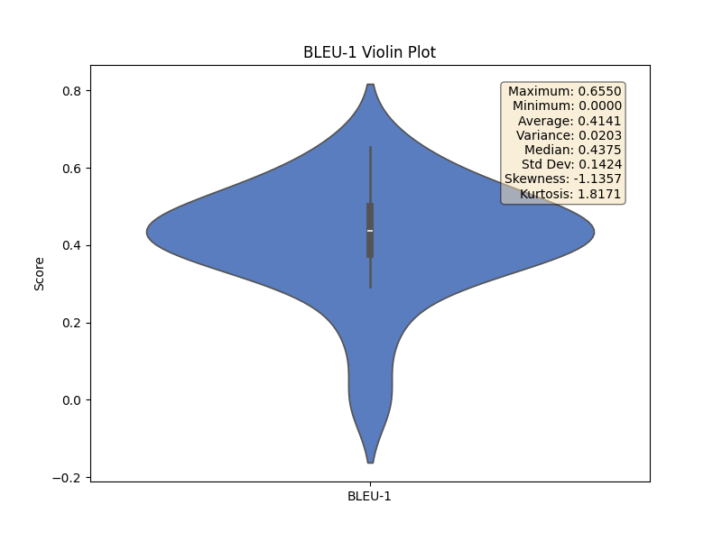

# NLP-Metrics

An integrated suite of NLP evaluation metrics compatible with Python 3, supporting the computation of metrics such as METEOR, RIBES, GLEU, NIST, chrF, chrF++, BLEU, CIDEr, and ROUGE.

## Features

This toolkit provides a unified interface to calculate the following popular NLP evaluation metrics:

- **METEOR**
- **RIBES**
- **GLEU**
- **NIST**
- **chrF / chrF++**
- **BLEU (1-4)**
- **CIDEr**
- **ROUGE-L**
- **Translation Edit Rate(TER)**

## Visualization

The toolkit automatically generates violin plots for each metric, showing the distribution of scores across all evaluated samples. Here's an example of the BLEU-1 metric visualization:



*The violin plot displays the score distribution, including statistical measures such as mean, median, standard deviation, and other descriptive statistics.*

## Usage

You can run the evaluation directly from the command line using `main.py`. The script takes two arguments: the path to the ground truth (original) captions and the path to the generated captions.

```bash
python main.py
```

This will run the evaluation using the example files provided in the `examples/` directory and print the scores for all supported metrics.

### Example Output

```
=== Evaluation ===
BLEU-1: 0.4141
BLEU-2: 0.2266
BLEU-3: 0.0972
BLEU-4: 0.0367
CIDEr: 0.4841
GLEU: 0.1247
METEOR: 0.3863
NIST: 1.5182
RIBES: 0.1706
ROUGE: 0.3408
TER: 1.1457
chrF: 0.3459
chrF++: 0.3276
```
*(Note: Scores are illustrative and may vary based on the data.)*

### Programmatic Usage

You can also use the `TextEvaluator` class in your own scripts.

```python
from main import TextEvaluator

# Initialize the evaluator
evaluator = TextEvaluator()

# Path to your data files
truth_path = 'examples/original_captions.json'
pred_path = 'examples/generated_captions.json'

# Run evaluation
metrics = evaluator.evaluate(truth_path, pred_path)

# Print results
evaluator.print_results()
```

## Data Format

The input files for both original (ground truth) and generated captions must be in JSON format. The JSON file should contain a dictionary where each key is a unique identifier (e.g., an image ID) and the value is a list of strings, where each string is a caption.

### `original_captions.json` (Ground Truth)

Each key maps to a list of one or more reference captions.

```json
{
  "captions_1": [
    "A man is riding a wave on a surfboard in the ocean.",
    "A man on a surfboard riding a wave."
  ],
  "captions_2": [
    "A group of people sitting at a dining table."
  ]
}
```

### `generated_captions.json` (Generated)

Each key maps to a list of one or more machine-generated captions to be evaluated against the references.

```json
{
  "captions_1": [
    "A person is surfing on a large wave."
  ],
  "captions_2": [
    "People are eating at a table."
  ]
}
```
