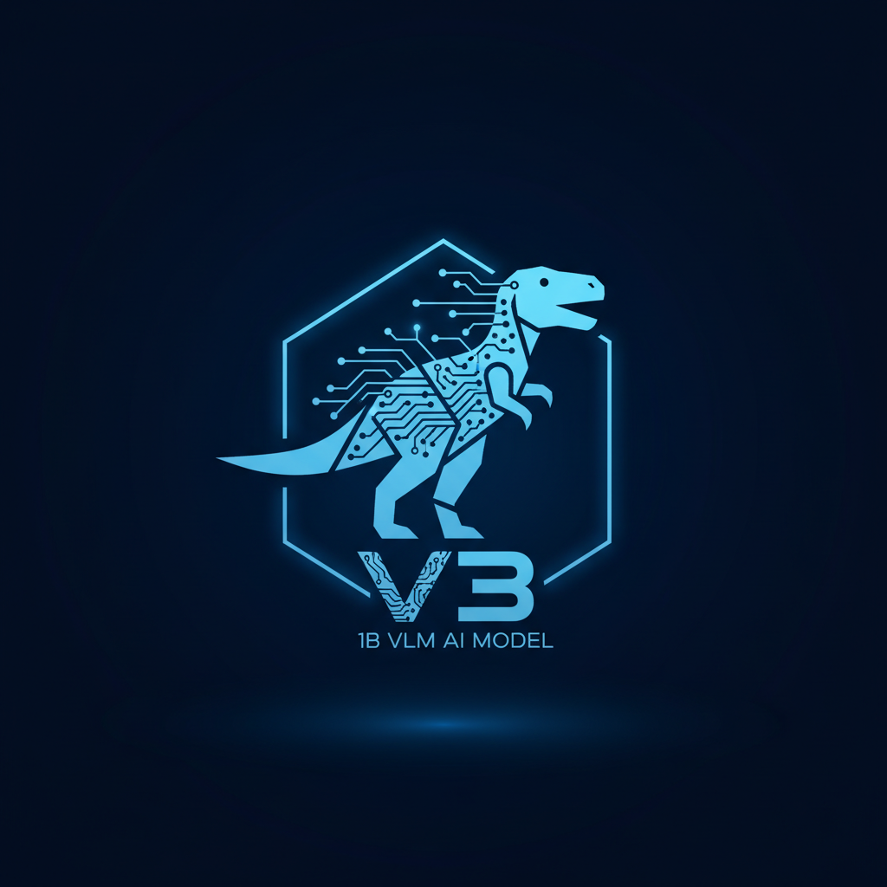

<p align="center">
  
</p>
<h1 align="center">QwenoV3</h1>

<p align="center">
  <strong>一个基于DINOv3-ViT-L和Qwen3-0.6B的小型视觉语言模型，参数量总计为1B</strong>
</p>

## 🌟 项目概述

QwenoV3 结合了强大的 DINOv3 视觉编码器和高效的 Qwen3 语言模型，构建了一个轻量级但功能强大的多模态模型。它能够理解图像和文本，并就图像内容进行流畅的对话。

## ✨ 主要特性

- **强大的视觉理解**: 采用 `DINOv3-ViT-L` 作为视觉骨干，能够从图像中提取丰富的语义特征。
- **高效的语言生成**: 基于 `Qwen3-0.6B` 语言模型，具备出色的对话和指令遵循能力。
- **轻量级设计**: 总参数量仅1B，便于部署和研究。
- **Streamlit Web界面**: 提供基于 Streamlit 的交互式 Web UI，支持模型切换、参数调整和图像上传。

## 🚀 快速开始

通过以下步骤快速启动 Web UI 并与模型进行交互：

### 1. 安装依赖

首先，请确保您已安装所需的 Python 库。
```bash
pip install -r requirements.txt
```

### 2. 下载模型权重

- [Pretrain](https://pan.baidu.com/s/1A2QkAZf2avs-mtV2gD_7YQ?pwd=chif)
- [SFT](https://pan.baidu.com/s/1irR0XOWI7_I_6jNcVSRsDw?pwd=3auy)

请注意，`StreamlitUI.py` 中的模型路径是硬编码的。根据您的实际存储位置修改 `StreamlitUI.py` 文件中的 `MODEL_MAPPING` 字典。

### 3. 启动Web UI

在项目根目录下运行以下命令：
```bash
streamlit run StreamlitUI.py
```
启动后，浏览器将自动打开 Web 界面，通常地址为 `http://localhost:8501`。现在您可以开始与 QwenoV3 对话了！

## 🔧 模型架构

- **视觉编码器**: `facebook/dinov3-vitl16-pretrain-lvd1689m`
- **语言模型**: `Qwen/Qwen3-0.6B`
- **融合层**: 两层线性变换

## 📚 数据集

使用 [LLaVA-NeXT-Data](https://huggingface.co/datasets/lmms-lab/LLaVA-NeXT-Data) 数据集进行单轮问答预训练、多轮问答SFT。

## 📊 训练详情

更多训练细节请访问: [SwanLab](https://swanlab.cn/@tian_ye/Qwenov3/overview)


